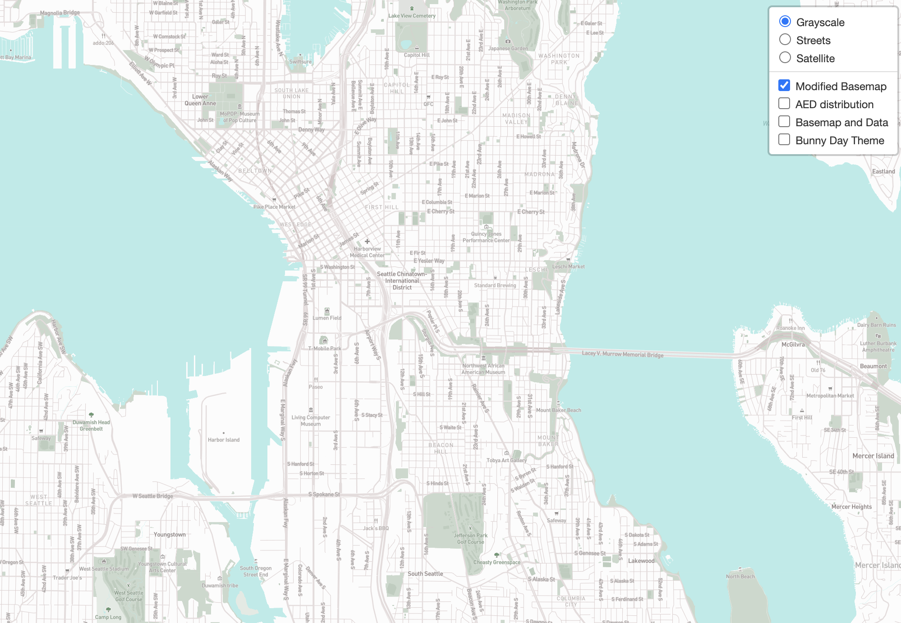
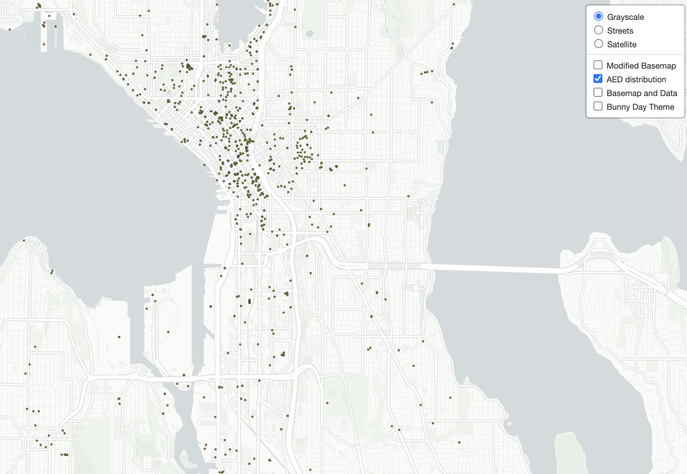
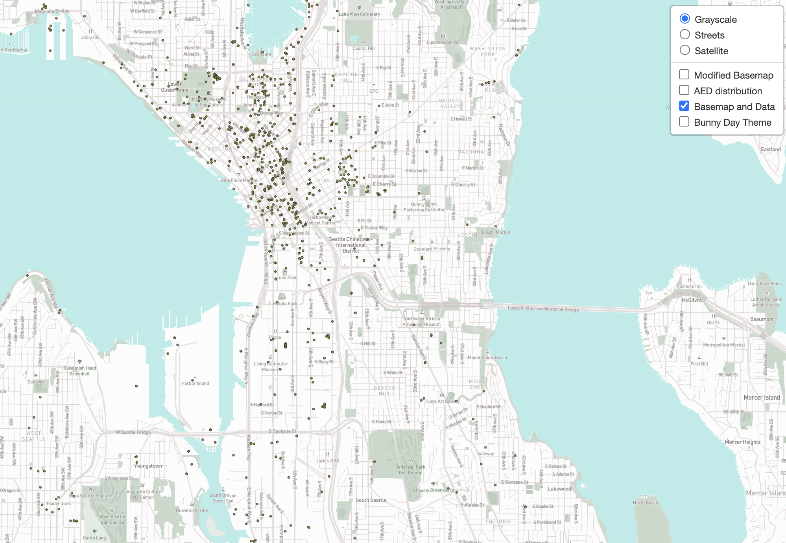
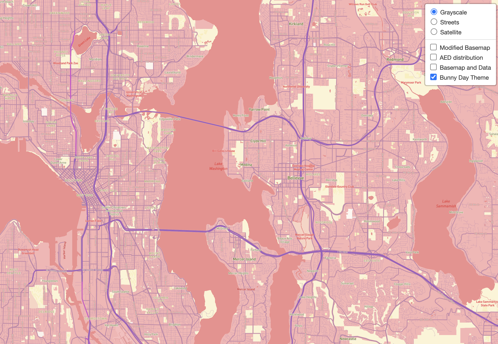

# Map Design and Tile Generations

### Introduction
[Link to the webmap](https://shi-lin-li.github.io/Map-Tiles/index.html) This exercise focus on the geography of Seattle, WA. Map tiles consist of two basemaps, one thematic layer about the distribution of Automated External Defibrillators(AED), and a tile set of thematic map and basemap combined.
### Tile 1 - Modified Basemap

- Description of Tile: The basemap features soft colored greenspace and de-saturated road labeling to convey the atmosphere of Spring season. 
- Geographic Area of Focus: Seattle, WA 
- Zoom Levels: Max Zoom - 14; Min Zoom - 10
### Tile 2 - AED Map Data

- Description of Tile: The distribution of Automated External Defibrillators(AED) in Seattle. 
- Geographic Area of Focus: Seattle, WA 
- Zoom Levels: Max Zoom - 14; Min Zoom - 10
  
### Tile 3 - Basemap and Data

- Description of Tile: The tile set is composed of the modified basemap from Tile 1 & the map data from Tile 2. 
- Geographic Area of Focus: Seattle, WA 
- Zoom Levels: Max Zoom - 14; Min Zoom - 10

### Tile 4 - Bunny Day Theme Basemap

- Description of Tile: The basemap is made using the color scheme of Easter.
- Geographic Area of Focus: Seattle, WA 
- Zoom Levels: Max Zoom - 14; Min Zoom - 10